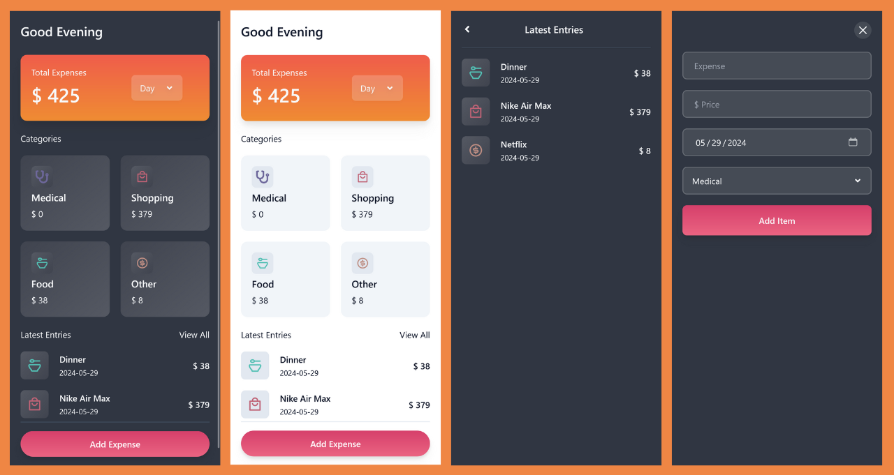

# Expense Tracker App

## Overview
Expense Tracker is a web application designed to help users manage and track their expenses effortlessly. Built with a modern tech stack, it provides a user-friendly interface for logging, categorizing, and analyzing financial transactions. The application leverages the power of React for a dynamic user experience and Vite for a fast development workflow.

## Live Demo
[Live Demo](https://expensextrack.netlify.app/)

## Screen Shots

## Features
- Expense Logging: Easily add and categorize expenses.
- Real-Time Updates: Experience a responsive UI with real-time updates.
- PWA Support: Install the app on your device for a native-like experience.
- Data Save in Localstorage.

## Tech Stack
- React: For building the user interface.
- Vite: For fast development and optimized builds.
- TailwindCSS: For easy and customizable styling.
- Framer Motion: For smooth animations.
- React Router: For navigation and routing.